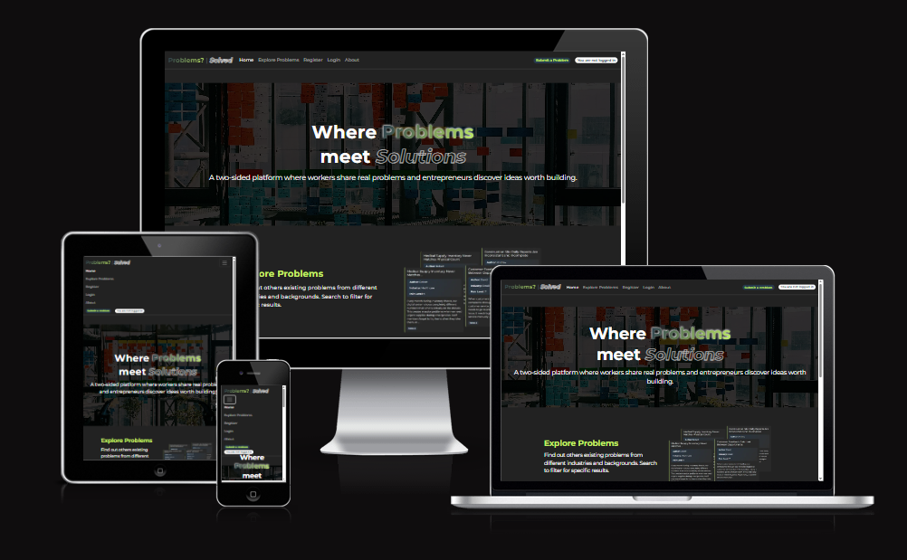
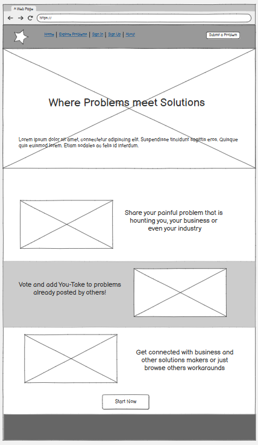
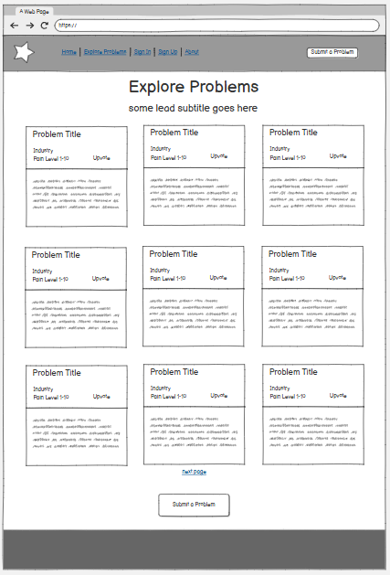
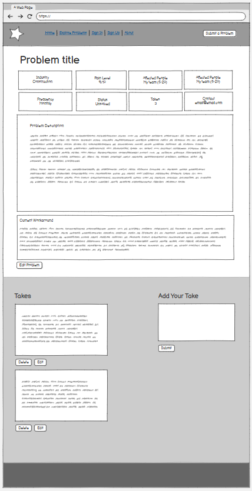
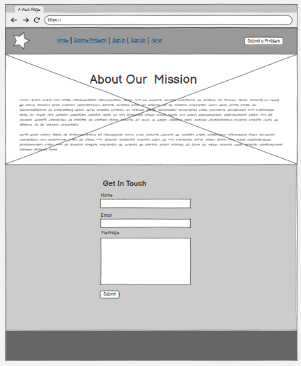
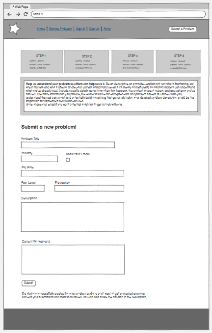
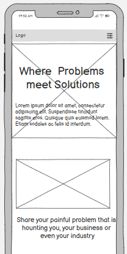
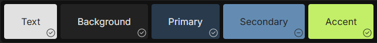
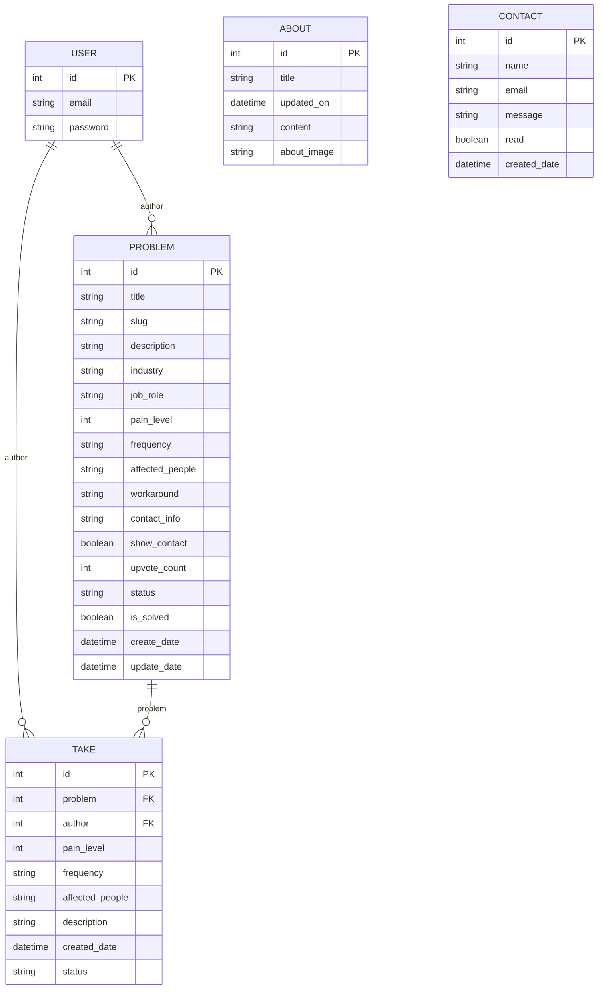

  
  
  
  
  
  

# Problem? Solved

No Problems, Only Solutions is a two-sided web platform where workers can post real workplace pain points and other users can add “Takes” to share context, workarounds, and validation. By turning everyday frustrations into structured, searchable posts, the project helps entrepreneurs discover problem-first business ideas while giving workers a place to document issues and learn from others experiencing the same challenges.

## Table Of Contents:

1. [Design & Planning](#design-&-planning)
   - [User Stories](#user-stories)
   - [Wireframes](#wireframes)
   - [Agile Methodology](#agile-methodology)
   - [Typography](#typography)
   - [Colour Scheme](#colour-scheme)
   - [Database Diagram](#database-diagram)
2. [Features](#features)
   - [Home page](#Home-page)
   - [Navigation](#Navigation)
   - [CRUD](#CRUD)
   - [Authentication & Authorisation](#Authentication-Authorisation)

3. [Technologies Used](#technologies-used)
4. [Libraries](#libraries-used)
5. [Testing](#testing)
6. [Deployment](#deployment)
7. [AI](#AI)
8. [Credits](#credits)

## Design & Planning:

### User Stories

| #   | User Story                                                                                             |
| --- | ------------------------------------------------------------------------------------------------------ |
| 1   | As a visitor, I want to browse public problems so I can explore what issues people are facing          |
| 2   | As a registered user, I want to create a new problem post so I can share workplace frustrations        |
| 3   | As a registered user, I want to edit my own problems so I can update or correct information            |
| 4   | As a registered user, I want to delete my own problems so I can remove content I no longer want public |
| 5   | As a visitor, I want to view detailed information about a problem so I can understand it fully         |
| 6   | As a visitor, I want to view comments or takes on a problem so I can see community responses           |
| 7   | As a visitor, I want to register and log in so I can participate in the platform                       |
| 8   | As a visitor, I want to contact the site administrators so I can ask questions or report issues        |
| 9   | As a visitor, I want to search and filter problems so I can find relevant issues                       |
| 10  | As a visitor, I want to view an About page so I can understand the platform's mission                  |
| 11  | As an admin, I want to moderate problems and takes so I can maintain platform quality                  |

### Wireframes

Wireframes created via **Balsamic**

  
  
  

  
  
  

Explain your agile approach to your project and insert screenshoots of your Kanban board (itterations, user stories, tasks,acceptance criteria, labels, story points...)

### Typography

**Montserrat** is used as the project’s primary typeface to keep the UI clean, modern, and easy to read across headings, navigation, and body text. It is imported via Google Fonts, with a sans‑serif fallback for consistent rendering. The font’s wide weight range supports clear visual hierarchy, while the project’s default styling uses a normal 400 weight for comfortable body readability.

### Colour Scheme

The following swatches were chosen for the main pallette

The following table includes variations used across the website

| Name           | Color                    | Swatch                                                                                              |
| -------------- | ------------------------ | --------------------------------------------------------------------------------------------------- |
| --text         | #e1e1e1                  |  |
| --background   | #222222                  |  |
| --background-l | #303030                  |  |
| --primary      | #283a4c                  |  |
| --m-primary    | #2f3b47                  |  |
| --mm-primary   | #383d42                  |  |
| --secondary    | #648cb3                  |  |
| --accent       | #c2ef67                  |  |
| --gradientB    | rgba(40, 58, 76, 0.8)    |  |
| --gradientG    | rgba(194, 239, 103, 0.3) |  |

### DataBase Diagram

## Features:

### Home-page

The Home page introduces the purpose of the platform and explains how to use it. It features a clear title, a large hero image, and simple visual sections that guide users through browsing problems, viewing takes, posting a problem, and adding a take.

### Navigation

- A responsive navigation bar provides quick access to the main areas of the site, including browsing problems, posting a new problem (for logged-in users), authentication links, and informational pages like About and Contact.

### CRUD

The core of the application has full CRUD functionality around user-generated content.

**Problems**

- **Create:** Logged-in users can submit a new workplace problem through a structured form with validation.
- **Read:** Visitors can browse public problems in a list view and open a full problem detail page.
- **Update:** Users can edit problems they authored to keep information accurate and up to date.
- **Delete:** Users can delete problems they authored, with a confirmation step to prevent accidental removal.

**Takes (YourTake contributions)**

- **Create:** Logged-in users can add a “Take” to contribute context, alternatives, or workarounds.
- **Read:** Takes are displayed on each problem’s detail page so users can compare experiences and learn from others.
- **Update:** Users can edit takes they authored.
- **Delete:** Users can delete takes they authored.

**Contact form**

- Users can submit messages to the site through a contact form.
- Submissions are stored in the database for admin review.

### Authentication-Authorisation

- User authentication is implemented with **Django Allauth**, supporting registration, login, and logout.
- Authorisation rules restrict actions appropriately:
  - Only authenticated users can create content (problems and takes).
  - Users can only edit or delete content they created.
  - Visitors can browse public content but cannot post, or access restricted data.

## Technologies Used

- **HTML**
- **CSS**
- **Python**
- **Django**
- **PostgreSQL** (production database)
- **Django Allauth** (authentication)
- **Bootstrap 5** (responsive UI)
- **Crispy Forms** (form rendering and layout)
- **JavaScript** (enhanced UI interactions such as buttons and dynamic controls)
- **HTML5 / CSS3**
- **Google Fonts (Montserrat)** (typography)
- **Heroku** (deployment)
- **WhiteNoise** (static file serving in production)

## Testing

Please find all test in
[TESTING.md](TESTING.md)

## Deployment

This website is deployed to Heroku from a GitHub repository, the following steps were taken:

#### Creating Repository on GitHub

- Sign in to [GitHub](https://github.com/).
- Create a new repository for your project (or use an existing one).
- Push your project code to GitHub, making sure any secrets are **not** committed (use environment variables and a `.gitignore` file).

#### Creating an app on Heroku

- Go to [Heroku](https://www.heroku.com/) and sign in (or create an account if needed).
- From the dashboard, click **New** → **Create new app**.
- Enter an **App name** (it must be unique across Heroku).
- Choose a **Region** (pick the one closest to you, for example **Europe**), then click **Create app**.
- Once the app is created, use the app’s tabs to configure it:
  - **Settings**: where you manage app settings and environment variables (Config Vars).
  - **Deploy**: where you connect your GitHub repo and trigger deployments.
  - **Resources**: where you manage add-ons and dyno types if you need to scale later.

#### Deploying to Heroku.

- In your Heroku app, open the **Deploy** tab.
- Under **Deployment method**, choose **GitHub**.
- If prompted, click **Connect to GitHub** and authorise Heroku to access your GitHub account.
- In **Connect to GitHub**, search for your repository by name and click **Connect**.
- Under **Manual deploy**, select the branch you want to deploy (commonly `main`) and click **Deploy Branch**.
- When the build completes successfully, you can open the live site.

**Deployed site:** https://projectproblems-e3632064db94.herokuapp.com/

 

## AI

### AI Assistance (Brief Reflection)

AI tools (Claude, GPT) were used selectively to speed up implementation and improve clarity in a few key areas. The focus was always on getting reliable outcomes, then reviewing and adapting the generated code to match the project requirements and Django best practices.

#### Key code decisions supported by AI

- **Rapid scaffolding of standard Django patterns:** AI helped generate starting points for common structures, such as using `TemplateView` for a simple landing page route. This reduced setup time and kept the URL configuration clean.
- **Improved form layout and usability:** AI suggestions supported the decision to customise the Problem submission form layout (via Crispy Forms), resulting in a clearer, more structured input flow and a better overall user experience.

#### Bug identification and fixes

AI was also used as a debugging companion to quickly identify likely causes and propose fixes. Key interventions included:

- **Deployment (Heroku) compatibility:** Troubleshooting revealed a deployment issue that was resolved by updating the Gunicorn version (switching to `gunicorn==22.0.0`).
- **Search + pagination edge case:** AI helped pinpoint an issue where pagination behaved incorrectly for logged-in users due to the queryset including items that should not be visible. The solution was to adjust the view logic to filter results based on authentication status, ensuring only `public` posts (or the user’s own posts) were included.
- **Static assets:** A favicon issue was resolved by ensuring the file lived in the static directory and was referenced correctly using Django’s `` tag.

#### Performance and UX improvements

AI contributed mainly by accelerating iteration:

- Suggested UI and layout refinements that made pages easier to scan and forms quicker to complete.
- Helped reduce unnecessary complexity by recommending simpler approaches where a full custom view was not required (for example, template-based rendering for the home page).

#### Workflow impact

Overall, AI improved efficiency by reducing time spent on boilerplate, speeding up debugging, and providing quick alternatives during implementation. The final code and decisions were kept under manual control through review, testing, and incremental changes rather than copying generated output unchanged.

## Credits

List of used resources for your website (text, images, snippets of code, projects....)
